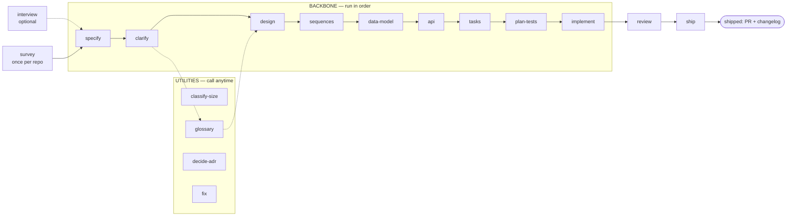

# SDD — Spec-Driven Development for Claude Code

SDD is a self-contained Claude Code plugin. It moves a feature from a one-line idea to
**reviewed, verified, shipped** code. It uses **23 atomic, stack-agnostic skills**: 19 skills in
the core spec-to-ship pipeline and 4 embroidery capability skills (`embroidery-digitize` →
`embroidery-optimize` → `embroidery-export` → `embroidery-qa`). It also uses a
**TDD implementation engine**. A living roadmap sits above the per-feature flow.

Each skill has three properties:

- **Socratic.** The skill examines each decision with you. It does not give you a large block of output.
- **Gated.** A stage hard-refuses when its prerequisite artifact is missing.
- **Stack-agnostic.** The skills do not hard-code a language, a tracker or a test tool. They detect what your repo uses.

The Q&A skills (`specify` / `clarify` / `design`) are also **depth-tunable**. An easy / medium / hard
dial sets how many decisions the skill makes for you and how many trade-off questions it asks you.

All English text of the plugin and of the artifacts that it writes obeys ASD-STE100 (Simplified
Technical English). The full rule is in [`skills/_shared/ste100.md`](./skills/_shared/ste100.md).

## Install

**Claude Code** — native plugin:

```text
/plugin marketplace add rdobryanskyy/sdd-emb
/plugin install sdd-emb@sdd-emb
```

After you update to a new release, run `/plugin install sdd-emb@sdd-emb` again. Then run `/reload-plugins`.

**Codex CLI** — first, `cd` into your project. The script installs into the **current directory**
(`.agents/skills/` + `.codex/agents/`). To install under `~`, add `--global` after `codex`.
To install under a different directory, add `--prefix DIR`. This is useful for a test in a sandbox:

```sh
cd your-project
curl -fsSL https://raw.githubusercontent.com/rdobryanskyy/sdd-emb/main/install.sh | bash -s -- codex
```

Then restart codex, because codex finds skills at session start. Type `$sdd-emb-specify`.

Alternative — the plugin marketplace. The `add` command only **registers** the marketplace. It
does not install a plugin:

```text
codex plugin marketplace add rdobryanskyy/sdd-emb
```

Then, **inside codex**, run `/plugins`. Go to the `sdd-emb` marketplace tab and select
**Install plugin**.

The two paths register different skill names:

- The marketplace install registers the **original** skill names (`$specify`).
- The installer script adds a prefix to the names (`$sdd-emb-specify`). The reason: bare names such as
  `review` / `design` / `api` collide with generic skills.

**Use only one of the two paths.** They register different names for the same skills. If you use
both, each skill shows two times.

- To remove the script install, run `install.sh codex --uninstall` again from the same directory
  (or with the same `--global` / `--prefix`).
- To remove the marketplace install, use `/plugins` → the sdd-emb tab → uninstall. Alternatively, remove
  the `[plugins."sdd-emb@…"]` entry from `~/.codex/config.toml`.

If the script finds a marketplace install that is already registered, it shows a warning.

> **Windows note.** The installer is a bash script. Run it from Git Bash or WSL. The names of the
> directories that it writes (`.agents/`, `.codex/`, `.cursor/`) start with a dot. Explorer hides
> these directories by default. To see them, enable «Hidden items» (or use `dir /a`).

**Cursor** (2.4+) — use the same script. First, `cd` into your project. The script installs into
`.cursor/skills/` + `.cursor/agents/` of the current directory. Use `--global` for `~`, or
`--prefix DIR` for a different directory:

```sh
cd your-project
curl -fsSL https://raw.githubusercontent.com/rdobryanskyy/sdd-emb/main/install.sh | bash -s -- cursor
```

Then restart Cursor (or run **Developer: Reload Window**). To start a stage, type `/` in the chat
and select `sdd-emb-specify`. Cursor also reads `.agents/skills/`, thus Cursor can also see a Codex install.
When the Cursor marketplace lists the plugin, you can also install it from the in-app marketplace
panel, with project scope or user scope.

One table shows how each Claude-specific mechanism maps to Codex / Cursor. These mechanisms are
`AskUserQuestion`, subagents, `/clear` and the implement engine modes. The table is
[`skills/_shared/tool-adapters.md`](./skills/_shared/tool-adapters.md).

## Start here

The flow is a straight line: **each stage writes a file that the next stage reads.** Run the stages
in sequence. The diagram and the table are below.

```text
/sdd-emb:survey                         ← once per repo: map an existing codebase, OR bootstrap an empty one
/sdd-emb:specify checkout-discounts     ← interviews you, writes the spec (you don't bring one)
/sdd-emb:design … → /sdd-emb:implement … → /sdd-emb:review … → /sdd-emb:ship
```

Know these two facts before you start:

- **`survey` runs one time for each repo.** On an existing codebase, it maps the current architecture
  to `docs/architecture-map.md`. Each later stage reads this file. On an empty repo, it runs a short
  foundation session and scaffolds the skeleton ([detail below](#where-we-study-the-codebase--hold-the-current-architecture)).
- **`specify` *creates* the spec** from a short interview. You bring the idea, not the document.

After that, do the backbone stages in sequence. Each step reads the file of the previous step. If
that file is missing, the step refuses. Thus, you cannot skip a stage by accident.

**Each stage ends with a handoff block that you can copy** ([`skills/_shared/handoff.md`](./skills/_shared/handoff.md)).
The block has three parts:

- *What I did*.
- *Review before continuing*. This part links to the files that the stage wrote. You can examine
  them at the gate.
- *Run next*. This part gives **`/clear`**, and then the next `/sdd-emb:…` command in a fenced block.
  You can copy the command with one click.

The `/clear` is important. Each stage is gated and **reads its inputs from disk again**, thus it
does not need context from the previous stage. The `/clear` keeps the context small. It also stops
the conversation of one stage from going into the next stage. There are two exceptions:

- Loop-backs. When `review` sends the work back to `implement`, stay in the context and iterate.
- Utilities. For utilities, `/clear` is optional.

The block looks like this:

```md
## ✅ specify — checkout-discounts

**What I did**
- wrote docs/features/checkout-discounts/spec.md — size M (from .size); proposed commit `spec: checkout-discounts`

**Review before continuing**
- docs/features/checkout-discounts/spec.md — goals, user stories, the §5 acceptance criteria

**Run next**
1. /clear — mandatory (fresh context; the next stage re-reads its inputs from disk)
2. then run:  /sdd-emb:clarify checkout-discounts
```

## The flow

There are three types of skill:

- The **backbone** skills are a straight line that you do in sequence. You use most of your time here.
- The **utilities** are skills that you use when you need them.
- Two skills **close the loop** after the code is written.



### Step 0 — survey (once per repo, before the backbone)

| # | Skill | What it does | Reads → Produces |
|---|---|---|---|
| 0 | **survey** | Existing repo → scans one time and keeps a record of the current architecture. Empty repo → level-adaptive foundation session → sets the foundation and writes a scaffold `tasks.json` for `implement`. | the repo → `docs/architecture-map.md` (+ scaffold `tasks.json` on greenfield) |

### Backbone — the straight line (run in order)

| # | Skill | What it does | Reads → Produces |
|---|---|---|---|
| 1 | **specify** | Interviews you to record the idea. Writes the product spec + acceptance criteria. Reads the architecture map for constraints. | *your idea*, `architecture-map.md` → `spec.md` |
| 2 | **clarify** | Examines the spec for ambiguities (a devil's-advocate pass). Closes or defers each ambiguity. | `spec.md` → tightened `spec.md` |
| 3 | **design** | **Matches the feature to your existing architecture** (see below) + **declares the target surfaces**. Writes the Arc42 SAD + C4 + ADRs. | `spec.md` (+ `CONTEXT.md` if present) → `sad.md`, `adr/*` |
| 4 | **sequences** | Draws the runtime flows as Mermaid sequence diagrams. | `sad.md` → `sad.md §6` |
| 5 | **data-model** | Designs the schema and writes the real forward+rollback migrations. The migrations are **staged** under the feature folder, not in the live tree (`implement` promotes them). | `spec.md`, `sad.md`, sequences → `data-model.md`, staged `migrations/*.up/down.sql` |
| 6 | **api** | Derives the OpenAPI contract from the data model (or from the existing schema on the fast lane) + sequences + spec. | `data-model.md`, sequences, `spec.md` → `contracts/openapi.yaml` |
| 7 | **tasks** | Divides the work into atomic tasks of ≤1 day + a `tasks.json` dependency DAG. | all of the above → `tasks/*`, **`tasks.json`** |
| 8 | **plan-tests** | Maps each acceptance criterion to ≥1 test (inline in the spec for XS/S). | `spec.md`, `data-model.md` → `test-plan.md` (M+) or an inline `## Test plan` in `spec.md` (XS/S) |
| 9 | **implement** | The TDD engine. For each task, it writes a failing test, makes it pass, runs the gate and commits. It **promotes** each staged migration into the live `migrations/` when it builds the task. | `tasks.json` + all artifacts → code + tests + promoted migrations, committed |

### Close the loop (after the code is written)

| # | Skill | What it does | Reads → Produces |
|---|---|---|---|
| 10 | **review** | An **independent, clean-context** code review of the *whole* change against spec/AC + quality. | the diff + `spec.md` → review record, `PASS` / `CHANGES REQUESTED` |
| 11 | **ship** | **Makes sure that the feature really runs** (not only green tests). Writes the changelog and opens the PR. | the reviewed change → changelog + PR (never auto-merges) |

If `review` finds an acceptance criterion that the change does not satisfy, it can send the work back
to `implement`. `ship` is the end: a reviewed, verified change with a changelog and an open PR. You
decide when to merge to main.

> **"We test and review, right?"** Yes, in two places. First, `implement` runs a **per-task gate**
> (unit + integration + lint + vet) on each task. Thus, each task is green before the commit. Then
> `review` does the **independent, whole-change** code review that a human reviewer does on the PR.
> After that, `ship` **runs the real feature** against its acceptance criteria. The tests run
> continuously inside `implement`. The cross-cutting review and the real-world verification are the
> explicit `review` and `ship` steps.

### Utilities — call whenever you need them (not part of the line)

- **interview** *(before specify)* — tests a raw idea before you commit to a spec. It is a Socratic
  pass that finds hidden assumptions, names trade-offs and gives better angles. At the end, it shows
  the weakest point + the next step (usually `/sdd-emb:specify`). It accepts any idea, not only features.
  It is optional. Use it when the idea itself is not stable.
- **classify-size** — sets the feature size XS/S/M/L/XL (writes `.size`). Later skills read it to
  select MVP depth or full depth. Run it at the start, or when the scope changes.
- **glossary** — records a domain term in `CONTEXT.md` with a definition. Run it when a new term
  shows. `design` and the spec read the glossary.
- **decide-adr** — writes a standalone ADR after the decision. Use it when `tasks` (or a review)
  finds a decision that must have a record, but `design` did not record it.
- **fix** — the **bugfix entry point**. It does these steps:
  1. It reproduces the bug.
  2. It traces the symptom to the acceptance criteria of the spec (regression / ambiguous AC / uncovered gap).
  3. It pins the bug with a failing test.
  4. It applies the minimal fix through the same gate that `implement` runs.
  5. It patches the spec and writes a fix record under `_fixes/`.

  It also works on a repo that has no specs (it fixes the code first and recommends `survey`).

## Interview depth (easy / medium / hard)

The Q&A skills start with a **depth dial**. This is one `AskUserQuestion` for each run. It sets how
many decisions the skill makes itself and how many questions it asks you. It changes *how many*
questions you get. It never changes *what the skill covers*:

- **easy** — the skill makes the reversible, low-risk decisions itself with sensible defaults. It
  asks only about the irreversible decisions or the decisions with a high blast radius. It
  **lists each assumption that it made**, so you can reject one. It does the minimum analyses. It
  writes the diagrams and gives a summary (no question for each item).
- **medium** (default) — the balanced Socratic walk: one question for each real decision.
- **hard** — the skill examines each decision and shows the trade-off first. It runs the **full
  suite of ideation analyses** (competitive research, three strategic approaches, multi-perspective
  review, devil's-advocate). It also examines edge cases more carefully.

The default is `interview_depth` in `.claude/sdd-emb.local.md` (if it is not set, medium). You can
override it for each run, or give `--depth=easy|medium|hard`. Full semantics: [`skills/_shared/interview-depth.md`](./skills/_shared/interview-depth.md).

The dial **never** makes these two items weaker. They apply at each level:

- **Readable diagrams.** `design` and `sequences` confirm each diagram **in prose**. The prose is a
  plain-language walk of the flow and its branches. The skills write the source to the file, where
  Obsidian renders it. They **never show raw Mermaid in the terminal** as the item to approve. If
  `mmdc` is installed, the skills also render an image. ([`skills/_shared/diagram-presentation.md`](./skills/_shared/diagram-presentation.md))
- **Full coverage of use cases and acceptance criteria.** Each spec §4 user story and each §5 AC is
  covered from start to end:
  - `specify` applies a **use-case floor**: each user story has ≥1 AC. `clarify` finds a story
    that lost its AC.
  - `sequences` maps each user story to a flow. It maps each AC to a flow, a branch, or an explicit
    non-runtime N/A (there is no limit on the number of flows).
  - `review` traces the full set through spec → sequences → data-model → api → tasks → implement.
    It flags each item that is missing.

  Also `easy`/XS covers each use case + AC. It only asks fewer questions about *how*.

## Target surfaces (what's being built)

At the start of §4, `design` declares the **target surface(s)** of the feature, that is, *what the
team builds*. The surface types come from C4 container types: `backend-service`, `web-frontend` (SSR or SPA), `mobile-app`, `desktop-app`,
`cli`, `worker`, `library-sdk`. These rules apply to the declaration:

- `design` derives the choice from the "for whom" of the spec. The spec stays at product level and
  never names a surface.
- The blast-radius gate controls the choice. More than one surface usually causes an ADR.
- The SAD §5 shows **one C4 container for each surface**.
- `design` writes the choice to the SAD frontmatter `target_surfaces: [...]`.

Downstream stages **read** that declaration and use it to gate their output. They never derive it again:

- **`api`** selects the contract form from the surface (HTTP/OpenAPI · gRPC · events · `cli.md` ·
  `public-api.md`). A UI surface *consumes* the backend contract. It does not write its own contract.
- **`sequences`** draws **UI-driven flows** (`<user>` → `<ui>` → `<service>`) for a UI surface.
- **`tasks`** adds a **`ui`** task layer for a UI surface (a backend-only feature keeps domain/infra/app/ports).
- **`plan-tests`** adds the **component / visual-regression / e2e-through-UI** tiers for a UI
  surface (the frontend "testing trophy"). `implement` detects the real tools (Playwright / Storybook / …).
- **`review`** traces each acceptance criterion through *its* surface. A UI AC goes to a component /
  e2e-through-UI test, not only to a backend test.
- **Reuse, do not make again.** `survey` makes a list of the existing **design system / components /
  tokens / styling** in `architecture-map.md` §Frontend. `design` / `tasks` / `implement` **compose and
  extend** these items, with the closest existing screen as the model. They do not write new UI
  from zero. This is the frontend equivalent of the backend rule: match the repo and copy the
  closest precedent.

This is **Option B**: the existing stages include the frontend rules (a `ui` layer, UI-architecture
ADRs, UI flows, frontend test tiers). There is **no** separate artifact for the component tree, the
design tokens or the screens. This is intentional. Full semantics:
[`skills/_shared/surfaces.md`](./skills/_shared/surfaces.md).

## Where the spec comes from

You do not write the spec as an input. **`specify` makes it.** Its interview asks 3–5 questions
about the problem, the users and the criteria for success. Then it writes a draft of the spec. It
validates each acceptance criterion with you. It runs a clean-context critic before it writes
`spec.md`. The idea is the input. The spec is the output.

## Where we study the codebase / hold the current architecture

The pipeline examines the existing system **one time, in `survey`** (Step 0). `survey` keeps a
record of the current architecture in `docs/architecture-map.md`: module layout, layers, datastores,
conventions, and a C4 of the existing system. That map is the single source for "what is already here":

- **`specify`** reads it. Thus, the constraints / non-goals of the spec agree with the real system.
  The spec does not put technical details into the acceptance criteria.
- **`design`** reads it and **matches** the feature to the real system. The SAD describes *your*
  system with the new feature, not a greenfield design without context. `design` scans the repo
  again (with `explorer`) only if the map is missing or old.
- **`data-model`** and **`implement`** read it for the persistence + wiring conventions that the new
  code must obey. They do not find these conventions again each time.

Thus, you do not ask "what is the current architecture?" at each stage. `survey` answers it one
time, and the map keeps the answer. If the repo has changed after the `reflects_commit` that the map
records, run `survey` again to refresh the map. In `design`, decisions that are expensive to reverse
go through a blast-radius gate and become ADRs.

**On an empty project, there is no current architecture to examine. Thus, `survey` makes one.**
Its greenfield mode does these steps:

1. It finds out how much you want to take part.
2. It selects the stack / structure / data approach / conventions with you (mostly defaults).
3. It sets them as the foundation. This is the same map, with the mark `mode: greenfield-bootstrap`,
   + foundational ADRs for the irreversible choices.
4. It writes a scaffold `tasks.json`.

Then `implement` builds the skeleton. The skeleton has a smoke test as its anchor
(«builds + boots + the test and migration tooling run»), not TDD for each folder. After that, the
repo is real, and the per-feature flow builds into it as usual.

## The roadmap (the portfolio layer)

The backbone builds **one feature at a time**. `roadmap` is the layer **above** the backbone. It is
one living `docs/roadmap.md` that shows the work *across* features. It stays at **outcome altitude**:
it shows the "why", not a list of features and dates. Such a list is the largest cause of waste in planning.

- **Now** — committed, specified, in progress. Each item links to its `docs/features/<slug>/` (it
  does not repeat the spec) + a status.
- **Next** — problems/opportunities that are intentionally *not* specified yet. A light **RICE**
  score (Reach × Impact × Confidence ÷ Effort) sets their order. This is the pool of candidates.
- **Later** — outcomes/themes that give a direction, with no detail.
- **Shipped** — the delivered items, with a link.

The pipeline updates the roadmap, thus it stays current. **`specify` promotes a feature to Now**, and
**`ship` moves it to Shipped**. The delivery itself keeps the roadmap in sync, so it does not become
old. The roadmap has a one-line "direction, not a promise" disclaimer and never has dates.

## The implementation engine

`implement` reads `tasks.json`, builds a dependency DAG, and runs a **TDD cycle for each task**:
`SELECT → RED → GREEN → REFACTOR → GATE → COMMIT`. These are the steps:

1. It writes a failing test first.
2. It proves that the test fails for the correct reason.
3. It writes the minimal code to pass the test.
4. It keeps the tests green during the refactor.
5. It runs the gate.
6. It commits with `SDD-Task` / `SDD-AC` trailers.

There are three execution modes. The engine selects the mode from the settings + the DAG shape.
If a mode is not available, the engine falls back to a simpler mode:

- **Sequential single-agent TDD** — the default. All other modes fall back to this mode.
- **Agent team** (`team_mode: true`) — `test-author` → `implementer` → `reviewer`
  on the DAG. A shared task list coordinates the agents. Each agent has its own git worktree.
- **Dynamic workflow** (`workflow_mode: auto`) — a generated `Workflow` pipeline. It runs
  independent tasks in parallel, up to a parallelism limit.

## Models, effort & agents

Each skill and each agent declares an **execution profile** in its frontmatter. The profile sets the
model, the reasoning effort and the agents that it starts:

```yaml
# a skill's frontmatter
model: opus        # haiku | sonnet | opus | fable | inherit (fable — reachable via judgment_model / env, agents keep tier-alias defaults)
effort: high       # low | medium | high | xhigh | max
agents: [critic]   # the agents this skill spawns
```

The **type of work** sets the model, not personal preference:

| Kind of work | Model | Effort | Who |
|---|---|---|---|
| Judgment (spec, design, review, critique, ambiguity, strategy, algorithm choice) | `opus` | `high` | specify, clarify, design, review · `reviewer` / `critic` / `devils-advocate` / `strategist` / `analyst` / `mathematic` |
| Execution (write tests, write code) | `sonnet` | `medium` → `high` on escalation | `test-author`, `implementer` |
| Research / data collection (+ web) | `sonnet` | `medium` | `researcher` (competitive / adjacent-solution research) |
| Search / scan / derivation | `haiku` / `inherit` | `low` / `medium` | `explorer`; data-model, api, sequences, tasks |

There are ten agents (`agents/`):

- **explorer** (brownfield scan)
- **test-author** (failing tests)
- **implementer** (makes the tests pass)
- **reviewer** (independent review)
- **critic** (coherence critique)
- **devils-advocate** (ambiguity + failure-mode hunt)
- **researcher** (competitive / web research)
- **strategist** (three strategic approaches)
- **analyst** (multi-perspective review)
- **mathematic** (mathematical / algorithmic adversary)

The read-only agents run in a **clean isolated context** (a new view). They give only cited
findings. `researcher` / `strategist` / `analyst` are the **ideation analyses**. `specify`
dispatches them, and the depth dial controls them (easy skips them; hard runs the full suite).

The calling skill sends `mathematic` when a spec, a design, a task or code uses a nontrivial
algorithm or numerical method. It runs as a **companion** to a `critic`/`devils-advocate` pass, or
as a **direct** dispatch. The calling skill must dispatch it, because a subagent cannot dispatch
another subagent. For details, see
[`skills/_shared/math-adversary.md`](./skills/_shared/math-adversary.md).

Two policy controls apply on top of the table:

- **`judgment_model`** (`.claude/sdd-emb.local.md`; `opus | fable`). This one switch changes **all**
  judgment agents (`reviewer` / `critic` / `devils-advocate` / `strategist` / `analyst` /
  `mathematic`) to the Mythos-tier model. The `agents/*.md` files keep their tier-alias defaults. A
  per-role `model_<role>` key still has priority.
- **L/XL features.** On these features, the critical verifications run at **`effort: xhigh`**
  (with `CLAUDE_CODE_EFFORT_LEVEL`). These are the `reviewer` in `review` and the `critic` in
  `design`/`specify`. The other judgment work stays at `high`.

One file contains the full policy: [`skills/_shared/agent-roster.md`](./skills/_shared/agent-roster.md).
The policy includes the override precedence (`env > invocation > model_<role> > judgment_model >
frontmatter > session`), the `.size` scaling, and the env-var fallback. Some builds ignore the
`effort:` key, and the fallback is for those builds.
Short version: if a run does not seem to reason enough, set `CLAUDE_CODE_EFFORT_LEVEL`.

### Configuration — `.claude/sdd-emb.local.md`

The pipeline **creates** this per-project settings file (YAML frontmatter) **automatically**, with
**documented defaults**. It does this the first time that a skill needs the file, usually `specify`
at the start. It also adds the file to `.gitignore`, because the file is per-developer.

The file **documents itself**. Each key has its default, its permitted values and a one-line
explanation inline. To change the behavior, edit the file.

Two keys are **plugin-wide**:

- The Q&A skills (`specify` / `clarify` / `design`) read `interview_depth` to preselect the depth dial.
- Each artifact-writing skill reads `artifact_language`. This key sets the language of the pipeline
  documents. It applies to prose only. Section headings, frontmatter and machine tokens stay in
  English (full rule → [`skills/_shared/artifact-language.md`](./skills/_shared/artifact-language.md)).

The other keys configure the `implement` engine:

```yaml
interview_depth: medium    # easy | medium | hard — default depth for specify/clarify/design
artifact_language: en      # en | uk — the language pipeline documents are written in (headings + machine tokens stay English)
tdd: true                  # enforce red→green→refactor
team_mode: false           # true → agent team via TeamCreate
workflow_mode: auto        # auto → dynamic Workflow; off → never
max_parallel_agents: 3
isolation: worktree        # worktree | inplace (parallel>1 ⇒ forces worktree)
stop_on_red: true
max_red_retries: 3
gate_lint: true
gate_vet: true
require_integration: auto  # auto | always | never (Docker-probed)
auto_commit: per_task      # per_task | per_phase | off
branch_strategy: feature   # feature | current
cmd_test_unit: ""          # empty = autodetect (escape hatch)
cmd_test_integration: ""
cmd_lint: ""
cmd_vet: ""
model_test_author: sonnet  # per-role model + effort (see Models, effort & agents)
model_implementer: sonnet
model_reviewer: opus
judgment_model: opus       # opus | fable — one switch for all judgment agents (reviewer/critic/devils-advocate/strategist/analyst/mathematic)
effort_test_author: medium # raised to high on escalation / for L-XL features
effort_implementer: medium
effort_reviewer: high
```

The engine detects commands with a stack-agnostic cascade: settings override → Makefile targets →
`package.json` scripts → language manifests (`go.mod`, `Cargo.toml`, `pyproject.toml`, …) →
Docker probe for the integration tier.

## Quick start (idea → shipped)

Each stage takes the **feature slug** as its argument. The slug is a kebab-case name that you make
one time at the start (here `checkout-discounts`). It becomes the folder for all artifacts:
`docs/features/checkout-discounts/`. Each stage uses it to find the files of the previous stage.
Thus, use the **same slug at each stage**.

```text
/sdd-emb:survey                             # once per repo: map the current architecture
/sdd-emb:specify       checkout-discounts   # interview → spec (reads the architecture map)
/sdd-emb:clarify       checkout-discounts
/sdd-emb:design        checkout-discounts
/sdd-emb:sequences     checkout-discounts
/sdd-emb:data-model    checkout-discounts
/sdd-emb:api           checkout-discounts
/sdd-emb:tasks         checkout-discounts
/sdd-emb:plan-tests    checkout-discounts
/sdd-emb:implement     checkout-discounts
/sdd-emb:review        checkout-discounts   # independent review of the whole change
/sdd-emb:ship          checkout-discounts   # verify it runs, changelog, PR
```

> **`/clear` between stages.** Each stage is gated and reads its inputs from disk again. At the end,
> it prints the next `/sdd-emb:…` command for you to copy (the handoff block). Loop-backs (`review` →
> `implement`) stay in the context. For utilities, `/clear` is optional.

Three notes on the first run:

- **You do not need `classify-size` to start.** If `.size` is absent, `specify` classifies the
  feature and writes `.size` itself. Run `/sdd-emb:classify-size <slug>` only for these cases: to set
  the size *before* `specify`, or to classify again when the scope changes.
- **To skip the depth question**, give the dial inline: `/sdd-emb:specify checkout-discounts
  --depth=easy`. This also works on `clarify` / `design`. The values are `easy|medium|hard` (see
  [Interview depth](#interview-depth-easy--medium--hard)).
- The artifacts go into `docs/features/<slug>/`.

### Routes — quick / standard / full

A small feature does not need the full backbone. It also must not need a confirmation at each
stage. Together with `.size`, the classification writes a **route** to
`docs/features/<slug>/.route`. The route is one word: `quick` / `standard` / `full`. The defaults
are **XS/S → quick, M → standard, L/XL → full**. You confirm the route and the size in the **same
single question**, and you can always select a different route. The route sets how each handoff
uses the optional stages (`clarify`, `sequences`, `data-model`, `api`, `plan-tests`):

- **`quick`** — the stage examines the skip condition **itself**. If the work of the stage does not
  exist, the stage **skips automatically and gives the reason** («auto-skipped clarify: zero open
  questions»). Then the `↳ or …` line changes and offers the full path. If the work *does*
  exist, the stage runs.
- **`standard`** — the current behavior. The handoff **offers** the skip as `↳ or …`, and you select.
- **`full`** — each optional stage runs. The handoff prints no skip alternatives.

Example — a feature with the size of a config toggle (`quick` route) in one session:

```text
/sdd-emb:specify  rate-limit-bump --depth=easy   # size XS + route quick confirmed in one question →
                                             #   zero open questions → auto-skips clarify (says why)
/sdd-emb:design   rate-limit-bump                # one actor, no multi-step flow, no schema change →
                                             #   auto-skips sequences + data-model → next: api or tasks
/sdd-emb:tasks    rate-limit-bump                # never skipped: implement consumes tasks.json
/sdd-emb:implement rate-limit-bump               # test plan lives inline in spec.md on quick
/sdd-emb:review   rate-limit-bump
/sdd-emb:ship     rate-limit-bump
```

These are the skip conditions:

- `clarify` — zero open questions.
- `sequences` — no multi-step flow.
- `data-model` — no schema change.
- `api` — no contract change.
- `plan-tests` — inline in the spec.

The canonical source for these conditions is [`skills/_shared/size-matrix.md`](./skills/_shared/size-matrix.md).
They are **N/A conditions, not size defaults**. Thus, an XS feature *with* a migration still runs
`data-model`, on each route. The route controls only the handoffs. It never blocks a stage. To
change the route during the work, run `/sdd-emb:classify-size <slug>` again. Alternatively, start a
skipped stage directly. It always runs.

### When a stage refuses

The stages are gated. Each stage **hard-refuses when the artifact that it consumes is missing**. It
then names the stage to run first. A refusal is not an error. It shows which step you skipped. These
are the most frequent refusals:

| Refusal | What it means | What to do |
|---|---|---|
| `design`: «run `specify` first» | This slug has no `spec.md` yet (or the slug has a different spelling). | Run `/sdd-emb:specify <slug>`. Make sure that the slug is the same as the folder under `docs/features/`. |
| `api`: «run `data-model` first» | The feature **changes the schema**, but it has no `data-model.md`. The contract cannot be invented one field at a time. (If there is no schema change, `api` does not refuse. It derives the contract from the existing schema. This is the legal fast-lane skip.) | Run `/sdd-emb:data-model <slug>`. |
| `tasks`: «no Accepted ADR» | `design` made no ADR. This is rare, and it usually shows that the SAD walk stopped too early. | Run `/sdd-emb:decide-adr <slug>` for the key decision, or run `/sdd-emb:design <slug>` again. |

## Embroidery capability skills

There are four standalone skills. They are **not** gates in the backbone above. They do the domain
computation that the 19-skill pipeline does not do:

- They change artwork into a stitch plan.
- They change the order of the plan for production efficiency.
- They serialize the plan to a real machine file format.
- They validate the plan against domain quality rules before production.

A product feature can ship one of these skills as a capability (for example, an "auto-digitize"
button). You still build that feature through the usual `specify → design → … → ship` backbone. Its
`implement` step calls these skills as it calls any library.

```text
/sdd-emb:embroidery-digitize logo-design    ← artwork/brief → a stitch plan (stitch type, underlay, density per region)
/sdd-emb:embroidery-optimize logo-design    ← changes the order of the plan to decrease jumps/trims/color changes
/sdd-emb:embroidery-export logo-design dst  ← serializes to a real machine format, with a round-trip check
/sdd-emb:embroidery-qa logo-design          ← cites findings against domain rules; PASS or ISSUES-FOUND
```

The domain reference material for these skills is in
[`docs/domain/embroidery/`](./docs/domain/embroidery/). The skills read it, and they do not
hard-code it. It covers file formats, machine constraints, stitch vocabulary and production
knowledge. Each fact has a citation. A `<!-- TBD: verify -->` marker shows a fact that nobody
confirmed independently. `embroidery-export` is the only skill that uses real tooling. It runs an
open-source embroidery library (`pyembroidery` by default) and does not calculate the file bytes
by hand. It does not report an export as successful before a round-trip check.

The conditional [`embroidery domain overlay`](./skills/_shared/embroidery-domain.md) connects the
same knowledge to the generic SDD roles:

- `survey`/`explorer` map the real machine-code boundaries.
- `researcher` examines format or machine facts that are not resolved.
- `critic` examines requirements and architecture for unsafe domain assumptions.
- `review` adds machine-code safety checks and checks for QA/round-trip evidence.

The overlay starts only for embroidery work. Usual code and the existing templates for
documentation follow the SDD flow with no change.

## Repository layout

```
.claude-plugin/   plugin.json + marketplace.json (self-marketplace)
.codex-plugin/    Codex CLI plugin manifest (+ .agents/plugins/marketplace.json — its self-marketplace)
.cursor-plugin/   Cursor plugin manifest (skills/ + agents/ auto-discovered from the root)
install.sh        Codex CLI / Cursor installer — copies the subtree, prefixes skill names, generates functional agents
agents/           explorer, test-author, implementer, reviewer, critic, devils-advocate, researcher, strategist, analyst, mathematic
scripts/          validate_plugin.py (CI gate: manifests + skill/agent frontmatter + the consistency invariants — links resolve, /sdd-emb: form, handoff block, single-source taxonomy, no _shared orphans)
skills/_shared/   canonical socratic-loop / critic / size-matrix / ask-style / interview-depth / diagram-presentation / surfaces / handoff / tool-adapters / math-adversary (referenced, not duplicated)
skills/<name>/    SKILL.md spine + references/ (heavy detail) + templates/ (output scaffolds)
.mcp.json         declares the sdd-emb-dashboard MCP server (auto-starts at session open; opt-in via dashboard_enabled)
server/           the dashboard MCP server (Bun + TypeScript): server.ts (MCP stdio + Bun.serve HTTP/WS), http.ts (routing + gating, testable), state.ts (disk→pipeline derivation), channel.ts (dashboard_* tools + command allowlist), paths.ts (docs/ scoping), frontmatter.ts (shared parser) + tests/ (bun test)
dashboard/        the browser UI (vanilla JS, terminal-green, read-only): index.html + app.js + style.css + vendor/ (marked, mermaid — vendored, offline; mermaid lazy-loads)
```

## Roadmap

These are possible directions. They are not promises and have no dates:

- **`sync`** — detection of drift between spec and code. It derives again what the code really does
  and compares it with the spec/SAD. Thus, long-lived features do not silently grow past their documents.
- **Traceability matrix + adherence score** — `review`/`ship` give one AC × (flow / contract
  / task / test / commit) matrix with a coverage score. This replaces the tracing that is only prose.
- **Tracker integration** — two-way sync between `tasks.json` and Jira / Linear / GitHub Issues.
  Currently, the export is one-shot and copy-paste.
- **Constitution file** — a repo-level set of rules that you must not break (security, compliance,
  style). Each stage reads it, and the validator enforces it. It adds to the per-feature artifacts.

**Shipped:** ~~MCP exposure~~ → see **[The visual dashboard](#the-visual-dashboard-opt-in)** below.

## The visual dashboard (opt-in)

The roadmap item *"MCP exposure — pipeline state served over MCP so external tools and dashboards can read
where every feature stands"* is shipped. It also got a control surface. These are its properties:

- The plugin has an **`sdd-emb-dashboard` MCP server** (`server/`, Bun + TypeScript).
- The server starts automatically with each Claude Code session (declared in `.mcp.json`).
- When enabled, the server serves a **local browser dashboard** (`dashboard/`) on `127.0.0.1`.
- The dashboard reads each feature from disk (`docs/features/<slug>/`). It shows the pipeline of the
  feature as a checklist with one line for each step: `done` / `skipped` / `pending` / `blocked`.
- It renders each artifact: markdown + **mermaid** diagrams from vendored libs, fully offline.
  It shows OpenAPI as plain YAML.

The dashboard renders artifacts in the language that they use. The state derivation reads only the
English structural tokens, and these tokens never change language (see `artifact_language` above).
If you use only markdown and do not opt in, the dashboard has no effect. It binds no port and opens nothing.

### Launch it — three steps

1. Install **[Bun](https://bun.sh)**. Bun is the server runtime, and the official Telegram plugin
   uses the same dependency. Use `curl -fsSL https://bun.sh/install | bash` or `brew install bun`.
2. Set `dashboard_enabled: true` in the `.claude/sdd-emb.local.md` of your project
   (see [Configuration](#configuration--claudesddlocalmd)).
3. Run **`/sdd-emb:start`** in your Claude Code session. The server already runs, because it started
   with the session. This step only gives it your project directory, binds the port if necessary, and
   prints the URL: `http://127.0.0.1:<port>/?session=<id>&token=<capability-token>`. Open that exact
   URL in a browser. The token in the URL authorizes the session.

A new session (or a server restart) makes a new token. Thus, an old tab stops working. Run
`/sdd-emb:start` again and open the new URL.

### How the panel updates

Three mechanisms work in layers:

1. **Live, from disk.** The server monitors `docs/` (`fs.watch`). When an artifact changes, the
   server sends a refresh over the WebSocket. The source of the change is not important: a
   dashboard-driven run, a skill that you ran in the terminal, or your edit of `spec.md` in vim.
   Changes show in about 1 second.
2. **More data, from Claude.** When Claude runs a stage, it also calls `dashboard_update` /
   `dashboard_log` / `dashboard_done`. These calls supply the live activity feed, the stage
   transitions, the review verdicts and the final handoff. A run in the terminal only still
   refreshes the artifacts (mechanism 1). It does not send the narration.
3. **Self-healing connection.** The server sends pings on the WebSocket to keep it open. If the
   connection stops, the browser connects again with backoff. It then syncs all data from disk
   again, thus no data stays old.

### How you control it

The **▶ Run next stage** / per-stage **run** / **⚒ Fix** (shows on a CHANGES REQUESTED review) /
**+ new** buttons control your live session. They are **asynchronous**, and the UI shows this clearly:

- A click sends the request to the server. The server builds a validated `/sdd-emb:<skill> <slug>`
  command from a strict server-side allowlist. Then it **queues** the command into your Claude
  session. It uses the same channel mechanism as the official Telegram plugin
  (`notifications/claude/channel`).
- The session consumes a queued command **only when it is idle at the prompt**. If Claude is busy
  with a task, the command waits. Each queued command has its own `queued → running → done` status
  line. The UI never shows false synchronous execution.
- The **depth selector** (topbar) sets `--depth` for dashboard-driven runs: `easy` (default; skills
  make reversible decisions themselves and rarely stop for questions), `medium`, or `hard`.
- Sometimes a dashboard-driven run really needs a human decision. Then Claude puts the question
  **into the panel** (`dashboard_ask`). A card with 2–4 option buttons shows in the activity pane,
  and the run pauses. Your click sends the answer back through the same queue, and the run
  continues. The browser sends only an option *index*. Claude itself wrote the option text. You can
  always answer in the terminal instead.
- Free text from the browser can never become a command. Only the validated skill name + slug +
  depth go through the allowlist.

### What the panel does NOT do

- It never writes to disk. Only the pipeline in your terminal edits the artifacts.
- It has no chat input. A blocking `AskUserQuestion` in the **terminal** stays in the terminal only.
  The option cards of the panel exist so that dashboard-driven runs do not stop there. But free
  text never goes from the browser into the session.
- It does not continue after a server restart. Run `/sdd-emb:start` again to get a new URL/token.

**Setup, config & troubleshooting:** [`server/README.md`](./server/README.md).

**Security:**

- The server binds to loopback only.
- The API is read-only. Each read is realpath-contained to `docs/` and has an extension allowlist.
- All routes must have a per-session capability token.
- The server builds inbound commands **only** from a server-side skill + slug allowlist. Browser text
  never becomes an arbitrary `/sdd-emb:` command.

## License

MIT © Kyrylo Genkov, with modifications © Rostyslav Dobryanskyy. See [LICENSE](./LICENSE).
