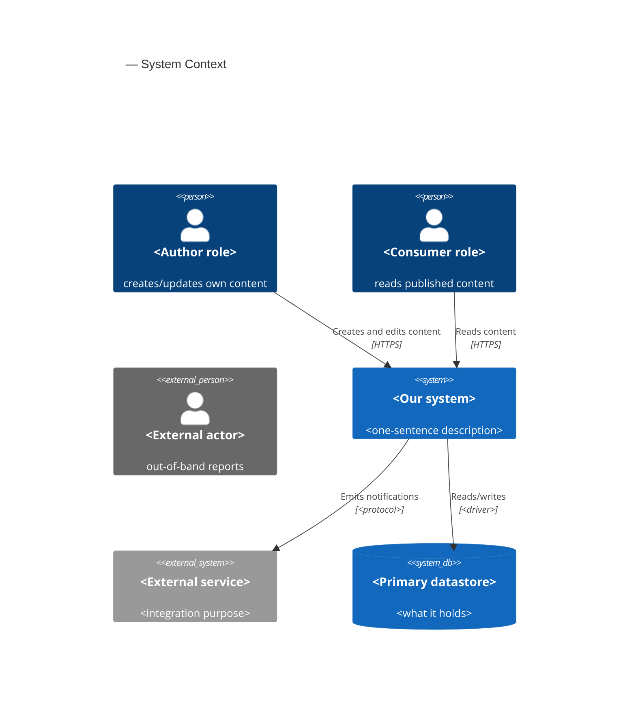
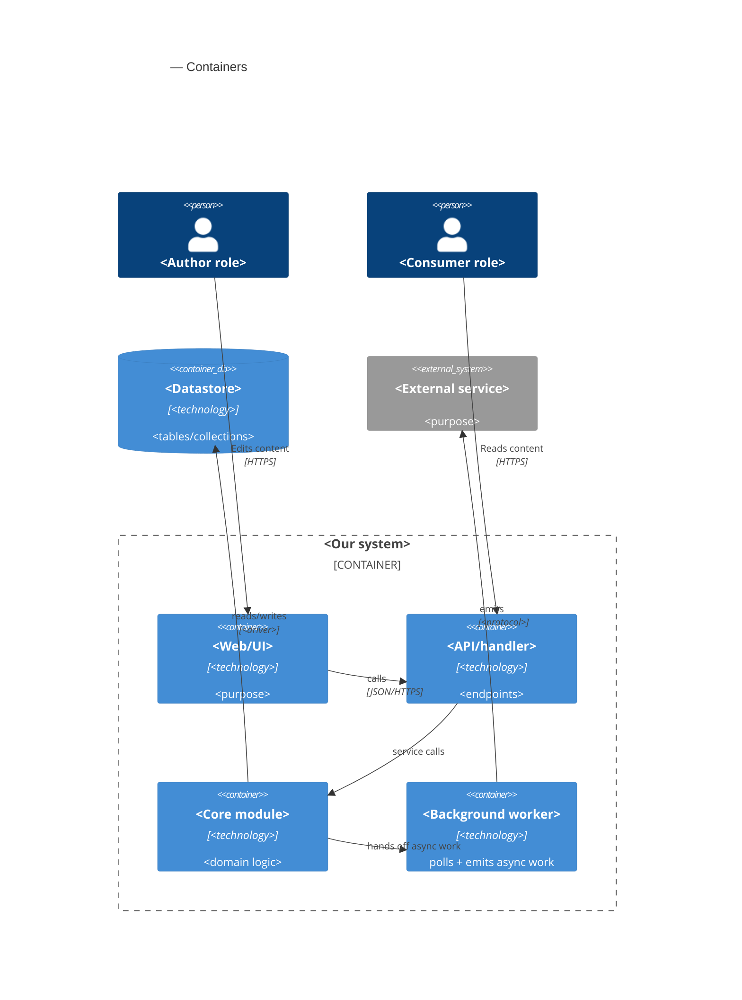
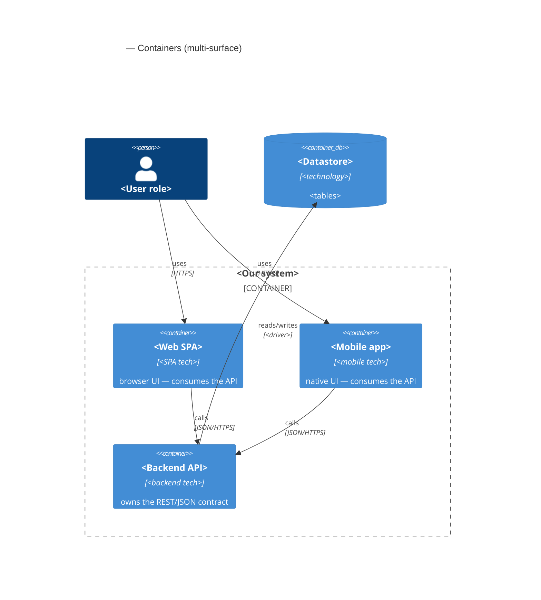

# C4 Mermaid syntax — quick reference for sad.md §3 and §5

> **TL;DR (UA).** C4 — 4 рівні діаграм як zoom на мапі. **L1 Context** (система як чорний ящик + актори + зовнішні системи) = §3 SAD. **L2 Container** (внутрішня декомпозиція: модулі, сервіси, БД, черги) = §5 SAD. L3/L4 — поза межами цього skill. *Кордон довіри* (`Container_Boundary`) — лінія, за якою дані не довіряєш без перевірки.

design writes C4 Level 1 (Context) in §3 and Level 2 (Container) in §5 as Mermaid blocks inline in `sad.md`. L3 Component and L4 Code are out of scope on purpose. If you need them, ask for a separate diagram pass. GitHub and Obsidian render Mermaid natively.

## L1 — System Context (`C4Context`)

Use it in §3. It shows the system as one black box, plus people and external systems. Use 5–10 elements maximum.



**Element types:**
- `Person(id, "name", "description")` — internal actor.
- `Person_Ext(id, "name", "description")` — external actor.
- `System(id, "name", "description")` — internal system.
- `System_Ext(id, "name", "description")` — external system.
- `SystemDb(id, "name", "description")` — external database (rare at L1).
- `Rel(from, to, "label", "protocol")` — connection. The protocol is optional, but we recommend it.

**Rules of thumb:**
- Show *your* system as one box. The decomposition is in L2.
- An external system = a different owner / process / lifecycle. Internal modules of the same deployable do **not** occur in L1.
- Use 5–10 elements in total. If you have more, you show too much.

## L2 — Container (`C4Container`)

Use it in §5. It shows the inside of your system: apps, services, datastores, queues. For a single deployable, show each *module* as a logical container.



**Element types:**
- `Container_Boundary(id, "label") { ... }` — puts the containers of one deployable unit into a group.
- `Container(id, "name", "technology", "description")` — internal container (app, service, worker).
- `ContainerDb(id, "name", "technology", "description")` — internal datastore.
- `ContainerQueue(id, "name", "technology", "description")` — internal message queue.
- You can use `System_Ext` and `Person` from L1 again.

**Rules of thumb:**
- For a single deployable: each module = one `Container`. The boundary contains the full process.
- Put the datastores *outside* the boundary if they are separate processes (almost always).
- Show a background worker / scheduled job as its own container. Its lifecycle is important, also when it runs in-process.

**Multi-surface features — one `Container` per declared `target_surface`.** When §4 declares more than one surface (frontmatter `target_surfaces` → [`../../_shared/surfaces.md`](../../_shared/surfaces.md)), §5 draws one container for each. A `[backend-service, web-frontend, mobile-app]` feature shows the SPA **and** the mobile app **and** the backend API. The two UI surfaces *consume* the contract of the API. Neither UI surface writes a contract:



## Common mistakes

- **Mixed levels.** Do not put a component (a single class/struct) in a Container diagram. Zoom out (it is part of the Container) or move to L3.
- **Typos in `Container_Boundary`.** Frequent typos: `Container_Bondary`, `ContainerBoundary` (no underscore). Mermaid then renders an empty block and shows no error.
- **`Rel` to an undeclared element.** Declare each `Person`/`Container`/`System*` first. Then write the `Rel` lines.
- **L1 with internal modules.** L1 = business scope. If a module occurs in L1, you are already at L2.
- **No label or protocol on `Rel`.** «Connected» gives the reader no information. Always write what it does + how.

## Validating before commit

```bash
# Optional pre-commit check — extracts the Mermaid block and runs the CLI parser.
npx -y @mermaid-js/mermaid-cli@latest -i <(awk '/^```mermaid$/,/^```$/' docs/features/<slug>/sad.md) -o /tmp/out.svg
```

In practice, open `sad.md` in Obsidian or push to GitHub, and examine the render. Both show syntax errors clearly.

## When the diagram doesn't fit

- L2 with more than 10–15 elements → split the feature into two SADs (one for each bounded context). Or move tactical containers (the worker) into a note below the diagram.
- L1 with 15+ external systems → you document the *organization*, not the *feature*. Show only «the systems this feature directly talks to».
