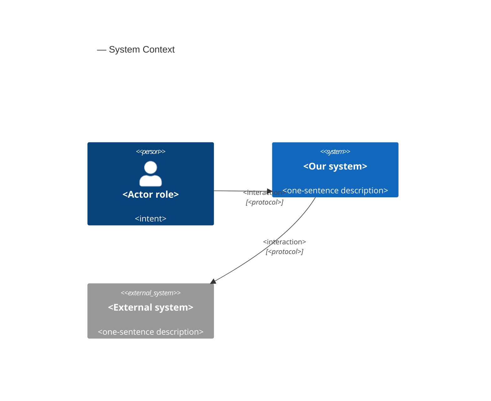
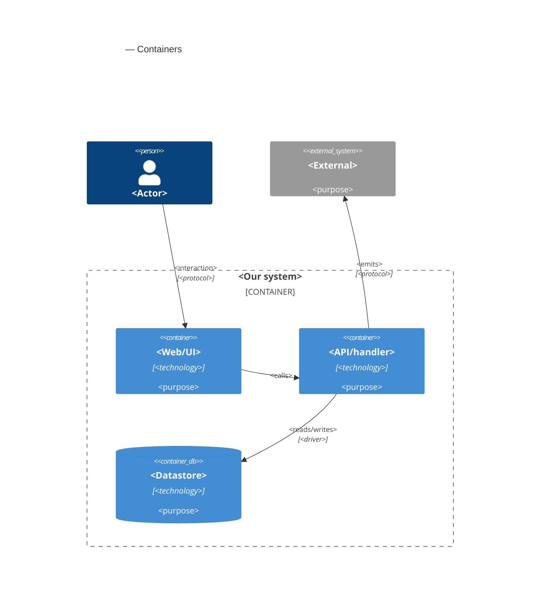

# Software Architecture Document — <slug>

<!-- 12 Arc42 sections. Empty section → <!-- N/A: <one-line reason> -->. -->
<!-- C4 Context (L1) is inline in §3. C4 Container (L2) is inline in §5. -->
<!-- Numbers in §10 come VERBATIM from spec.md §6 NFR. Do not invent or round numbers. -->

## 1. Introduction and goals

<!-- 🎯 Why: a durable record of «what + the three dominant qualities + who is interested». After a year,
     nobody remembers which three qualities were critical for this system.
     📋 Write: 1 ¶ intent + 3 lines of top-3 quality goals + a stakeholders table.
     ¶4 is the override slot. Critic `Override` resolutions write «Decision override: <headline>
     — rationale: <reason>» bullets here. Then downstream skills see the deliberate choice. -->

**Intent.** <One paragraph from spec §2 Goals — what we build and for whom.>

**Top-3 quality goals (1-liners; full scenarios in §10):**

1. <e.g. "Availability under partial failure of a downstream module">
2. <e.g. "Read performance for the dashboard under data-scale growth">
3. <e.g. "Recoverability with <30 min RTO">

**Stakeholders.**

| Role | Interest | Sign-off owner? |
|---|---|---|
| <author role from glossary> | <feature usage> | No |
| <consumer role from glossary> | <read usage> | No |
| Tech Lead | SAD approval | Yes |

<!-- Decision overrides (¶4) — the critic resolution loop fills them. Else, this stays empty. -->

## 2. Constraints

<!-- 🎯 Why: the §4 strategy works only when §2 records WHAT IS ALREADY FIXED — stack, versions,
     deadline, regulatory. This is an input, not an output.
     📋 Write: four blocks — Technical / Organisational / Conventions / Regulatory.
     📌 Pin versions («<datastore> 18», not «<datastore>»). Write «Q3 deadline — hard», not «ideally».
     Never N/A — each feature gets at least Conventions + Technical from the repo. -->

**Technical.**
- <Language + version>
- <Framework(s) + version>
- <Datastore(s) + version>
- <Architecture convention — e.g. the layering style from the project convention file>

**Organisational.**
- <Effort budget — e.g. 3 person-weeks>
- <Deadline — e.g. 2026-Q3 hard>
- <Team composition>

**Conventions.**
- <Link to the project's convention file>
- <Naming, ID strategy, error-handling pattern>

**Regulatory / external.**
- <e.g. data-retention / deletion behaviour per ADR-NNNN>
- <e.g. applicable compliance controls, or N/A with a reason>

## 3. Context and scope

<!-- 🎯 Why: shows the SYSTEM BOUNDARY — who talks to it from outside, and where the trust zone ends.
     Without §3, §5 and §8 (authorization) are not clear. Nobody knows what is «inside» vs «outside».
     📋 Write: 2–3 sentences of business context + an external-systems table + a C4Context block.
     📌 «External: none (deliberate, no third-party in v1)» is also a decision. Write it.
     Trust boundary — the line after which you do not trust data without a check.
     Never N/A — a greenfield also draws the planned actors + external systems. -->

<Business context in 2–3 sentences. What the system does for whom.>

<!-- brownfield: <one-line scan summary> (or «N/A — greenfield repo» if no source existed) -->

**External systems (in / out):**

| Actor or system | Type | Interaction |
|---|---|---|
| <author role> | Person | <what they do> |
| <external service> | System (internal/external) | <interaction> |
| <identity provider> | System (external) | <provides auth tokens> |

**C4 Context (L1):** <!-- syntax → references/c4-mermaid-syntax.md. Real names, no <placeholder> stubs. -->



## 4. Solution strategy

<!-- 🎯 Why: the 3–4 STRATEGIC PILLARS that each ADR comes from. Without §4, each ADR looks random,
     because there is no umbrella. ⭐ The densest section. The blast-radius gate almost always fires here
     (the decisions are irreversible + multi-module).
     📋 Write: 3–4 choices. Give each a heading + 2–3 sentences of rationale.
     📌 «Store content as a table of typed blocks» is a pillar. ADR-0001 comes from it. -->

**Top strategic choices (the seeds for ADRs):**

1. **<e.g. Module isolation through events>** — <2–3 sentences citing quality goals + constraints>.
2. **<e.g. Single-store persistence>** — <2–3 sentences>.
3. **<e.g. Server-rendered read side>** — <2–3 sentences>.

Each tactical decision in later sections must trace to one of these seeds. A tactical decision that *contradicts* a strategic choice is a red flag. Show it in §11.

## 5. Building block view

<!-- 🎯 Why: INTERNAL DECOMPOSITION — modules, containers, datastores. The static topology: who
     can talk to whom. Without §5, §6 (the flows) has no vocabulary of participants.
     📋 Write: 1 ¶ about the style (layered / hexagonal / clean / event-driven) + a folder tree + a
     C4Container block.
     📌 Draw ONE Container for each declared `target_surface` (frontmatter). A fullstack
     [backend-service, web-frontend] = a backend-API container + a web/SPA container. A
     [backend-service, mobile-app] = the API + the mobile app. The Container(web, …) line below is
     only the container of one surface. Replace or add containers for the surfaces that §4 declared. → _shared/surfaces.md
     📌 e.g. «web app, content API, media worker, datastore, object store, CDN». -->

<One paragraph: layered / hexagonal / clean / event-driven, and why.>

**Internal decomposition:**

```
<e.g. modules/<feature>/>
├── domain/       <entities + sentinel errors>
├── app/          <use cases / services>
├── infra/        <repository + integration impl>
├── ports/        <handlers, DTOs, error mapping>
└── wiring        <self-wiring entry point>
```

**C4 Container (L2):** <!-- syntax → references/c4-mermaid-syntax.md. Real names, no <placeholder> stubs. ONE Container for each declared target_surface (frontmatter). The web container below is one example surface. -->



## 6. Runtime view

<!-- 🎯 Why: the RUNTIME FLOW of 1–2 critical scenarios — who talks to whom, when, in what sequence.
     Without §6, §5 is only static boxes.
     📋 Write: a Mermaid sequenceDiagram. The participants are names from §5 (do not invent new names).
     The messages are semantic («saves a draft»). Use NO HTTP verbs / paths / status codes. The `api` stage
     adds endpoint-level sequences.
     📌 e.g. «author → web: composes draft → web → content API: save». Seed the primary flow(s) here.
     The `sequences` stage then covers each §5 AC (no cap). Never N/A for M+. XS/S keeps ≥1 happy-path flow. -->

**Critical flow 1: <flow name>**

```mermaid
sequenceDiagram
    actor Actor
    participant Web
    participant Service
    participant Store
    Actor->>Web: <action>
    Web->>Service: <call>
    Service->>Store: <write>
    Store-->>Service: ok
    Service-->>Web: result
    Web-->>Actor: confirmation
```

**Critical flow 2: <e.g. async event propagation>** — <if applicable, else N/A>.

## 7. Deployment view

<!-- 🎯 Why: the TOPOLOGY that DevOps must know without the deploy charts — how many replicas,
     where the background worker runs, AT WHAT NUMBERS we scale.
     📋 Write: 2–3 sentences about topology + monitoring + concrete threshold numbers.
     📌 e.g. «500 authors → partition by quarter» (not «we'll think about scale later»).
     🎯 N/A is permitted for XS/S that uses an existing deployment unit again with no change.
     Deployment-diagram scaffold → templates/deployment.md. -->

<Topology in 2–3 sentences. Where it runs, replicas, scaling thresholds.>

**Monitoring:**
- <Metrics — e.g. `<metric_name>`>
- <Alerts — e.g. «worker lag > 10 min → page on-call»>
- <Tracing — e.g. spans on the request boundary>

**Scaling thresholds:**
- <e.g. comfortable in one table up to N rows/year>
- <e.g. partition by quarter above N rows/year>

<!-- For XS/S with no deployment change: <!-- N/A: reuses existing deployment unit, no infra change --> -->

## 8. Crosscutting concepts

<!-- 🎯 Why: CROSS-CUTTING PATTERNS across many modules: logging, errors, authorization, ID
     strategy, events, caching. ⭐ The second-densest section. A pattern in one module is NOT
     here. A project-wide convention goes in the convention file.
     📋 Write: a table — concept / convention / where defined. One row for each concept.
     📌 e.g. «sortable time-based IDs generated in the app layer» as a default from the convention file. -->

| Concept | Convention | Where defined |
|---|---|---|
| Logging | <e.g. structured, fields `module=<name>`> | <convention file §X or here> |
| Authentication | <e.g. token-based via middleware> | <convention file §X> |
| Error handling | <e.g. domain sentinel → ports error mapping → JSON> | <convention file §X> |
| ID strategy | <e.g. sortable time-based ID in the app layer> | <convention file §X> |
| Internationalisation | <e.g. N/A, single language> | — |
| Observability | <e.g. tracing on the request boundary> | — |
| Events | <module-specific patterns, if any> | <here> |

## 9. Architecture decisions

<!-- 🎯 Why: the REVERSE INDEX of the adr/ folder. `ls adr/` gives the files. §9 gives the
     semantics — why they exist, which SAD section they attach to, and their status.
     📋 Write: a 4-column table, one row for each ADR. Mixed status is correct.
     📌 e.g. «0001 | Store content as a table of typed blocks | Accepted | §4». -->

| # | Title | Status | Section |
|---|---|---|---|
| <NNNN> | <imperative — e.g. "Use a sliding-window counter for rate limiting"> | Accepted | §<N> |
| <NNNN> | <imperative — e.g. "Co-locate the worker in the API process"> | Accepted | §<N> |

The ADR files are in `docs/features/<slug>/adr/NNNN-<title>.md`.

## 10. Quality requirements

<!-- 🎯 Why: the QUALITY TREE. Take a goal from §1 and divide it into concrete leaves: tests,
     metrics, configs, drills. ⭐ Without §10, §1 is only a manifesto. With §10, each declaration maps
     to an item that you can PROVE.
     📋 Write: for each §1 goal — When / Then / How-verify. Copy numbers from spec §6 NFR VERBATIM (do not
     round ≤250ms to ≤300ms — that is a critic F6 hit).
     📌 e.g. «p95 ≤ 500 ms on a block update, verified by a 100 req/s load test». -->

Expand each top-3 goal from §1 into a full scenario:

**QG-1. <quality attribute>**
- **When:** <trigger condition>
- **Then:** <expected behaviour with numbers from spec §6 NFR>
- **How verify:** <test / chaos drill / load test / metric>

**QG-2. <quality attribute>**
- **When:** <trigger>
- **Then:** <expected>
- **How verify:** <how>

**QG-3. <quality attribute>**
- **When:** <trigger>
- **Then:** <expected>
- **How verify:** <how>

## 11. Risks and technical debt

<!-- 🎯 Why: ⭐ records ALL items that can break — not only the technical items. Without §11, the team
     discusses risks at standups and then loses them. The debt is only in the memory of the person who accepted it.
     📋 Write: a risk/debt table — severity — mitigation — owner. Put accepted debt in its own block.
     📌 The first risk is frequently a product risk, not a technical risk. That is normal. -->

<!-- Severity literals: Low / Medium / High for regular risks. "Open question" for rows that
     a Save-as-OQ resolution creates during the Socratic walk (see references/socratic.md). -->

| Risk / debt | Severity | Mitigation | Owner |
|---|---|---|---|
| <e.g. Worker lag may reach hours during a downstream outage> | Medium | <alert >10 min, on-call playbook, retry backoff> | <DevOps> |
| <e.g. No event-schema versioning in v1> | Medium | <ADR-NNNN planned for v2, tolerate unknown fields> | <Backend> |
| Open architectural decision: <decision-headline> | Open question | Resolve before <stage trigger or YYYY-MM-DD>; <inline rationale from the Save-as-OQ> | <owner> |

**Accepted debt (acceptable in v1, plan to fix later):**
- <e.g. the entity is immutable / unversioned — OK for v1, may need audit versioning in v2>

## 12. Glossary

<!-- 🎯 Why: ⭐ the DOMAIN GLOSSARY that stops arguments a year later («checkpoint — weekly or
     biweekly? quarter — calendar or fiscal?»).
     📋 Write: a term / meaning table. Mix business + technical terms.
     📌 e.g. «Lesson | a unit inside a course made of blocks (text, video)». -->

| Term | Meaning |
|---|---|
| <e.g. domain object A> | <its meaning in this domain> |
| <e.g. domain object B> | <its meaning> |
| <e.g. domain invariant name> | <the rule, in plain language> |
