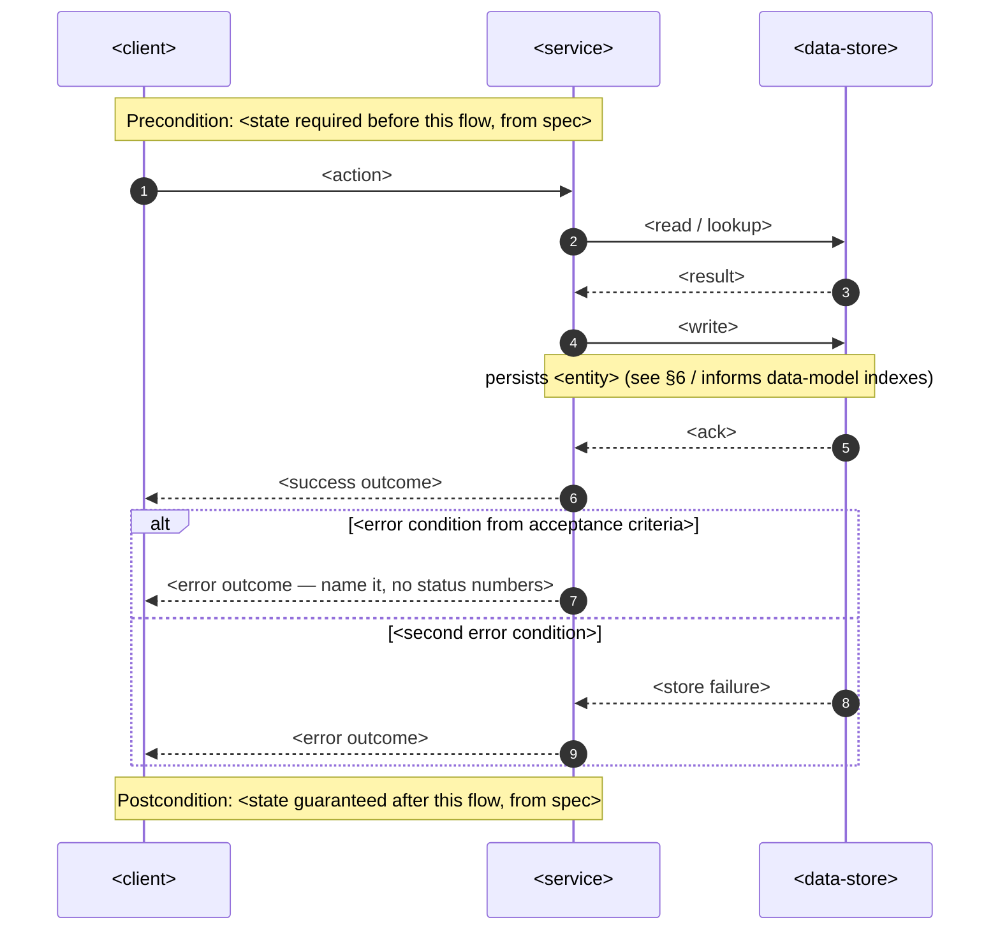
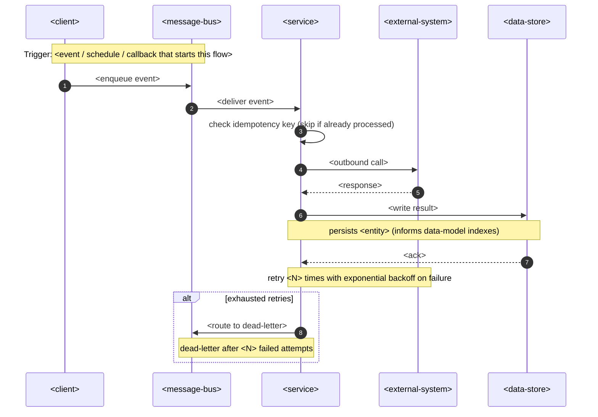

<!-- Template for `sequences`. Put it INLINE in docs/features/<slug>/sad.md §6 (Runtime view). -->
<!-- Write one `### <flow name>` block for each critical flow. Participants are GENERIC placeholders. -->
<!-- Replace the <…> message text and note text with the specifics of this flow. Do NOT replace the participant names. -->
<!-- Generic vocabulary (only these participants are permitted): -->
<!--   <client>          — the item that starts the flow (UI, CLI, a different service, a scheduler) -->
<!--   <service>         — the building block that owns this flow (from §5) -->
<!--   <data-store>      — the persistent store that the service reads and writes -->
<!--   <external-system> — a third party that the service calls -->
<!--   <message-bus>     — the async transport (queue / event stream) for flows that are not sync -->
<!-- `design`/`data-model` name the concrete technology. The runtime view does not. -->

### <flow name>

<!-- SYNC flow: request → response, with the error branches that the acceptance criteria of the spec demand. -->
<!-- Each write becomes a persist note. Then `data-model` knows what to index downstream. -->

### <async flow name>

<!-- ASYNC flow (incoming webhook / scheduled job / queued or event-driven step / third-party callback). -->
<!-- MUST have: an idempotency-key check as the first step of the handler, a retry note, a dead-letter branch. -->

