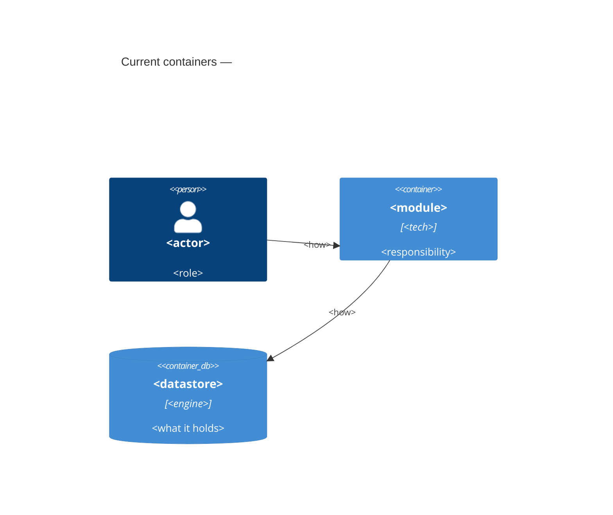

# Architecture map — <repo name>

> The **current** architecture (what exists today). `survey` writes this map, and
> specify / design / data-model / implement read it. If the repo changed after
> `reflects_commit`, run `survey` again to refresh the map. This file is generated. If a
> hand-maintained `docs/architecture.md` exists, it is authoritative. This map agrees with it
> below and does not replace it.

## Stack

<!-- instruction: give the primary language(s) + frameworks + versions, and the build/test tooling. Cite each item. -->

- Language / runtime: <…> (`file`)
- Frameworks: <…>
- Build / test / lint: <commands the repo uses — feeds implement's detection>

## C4 — system as it is

<!-- instruction: draw a C4 Context + Container of WHAT EXISTS (not a target design). Use real names. -->

## Module inventory

<!-- instruction: write one row for each top-level module/package, with its layers + the place where it is wired. -->

| Module | Path | Layers | Wired at | Responsibility |
|---|---|---|---|---|
| <name> | `<path>` | domain/app/infra/ports | `<file:line>` | <one line> |

## Conventions (cited — the rules a new feature must match)

<!-- instruction: give the cross-cutting patterns, each with ONE cited example. design/
implement must obey these patterns. -->

- **Module wiring / registration:** <pattern> — e.g. `<file:line>`
- **Error handling:** <pattern> — `<file:line>`
- **IDs:** <pattern> — `<file:line>`
- **Persistence / DB access:** <pattern> — `<file:line>`
- **Migrations:** <naming + tool> — `<file>` (`data-model` finds this convention and follows it)
- **Tests:** <unit/integration style + harness> — `<file:line>`
- **Inter-module communication:** <direct call / events / HTTP> — `<file:line>`
- **UI / styling (if a frontend exists):** <component library + styling approach> — `<file:line>` (the `ui`-layer work composes these — the details are in §Frontend / UI foundation below)

## Datastores

| Store | Engine | Accessed via | Notes |
|---|---|---|---|

## Frontend / UI foundation

<!-- instruction: fill this section ONLY if the repo has a frontend (web / mobile / desktop). This is
the UI to REUSE. The new `ui`-layer work must COMPOSE / EXTEND this design system + these components.
It must never make them again. For a backend-only repo, skip it with <!-- N/A: no frontend -->.
Cite a file for each item. -->

- **Component library / design system:** <in-repo `shared/ui/` and/or a 3rd-party kit> — `<path>`
- **Design tokens:** <colors / spacing / typography source — theme config / CSS vars / token file> — `<file>`
- **Styling approach:** <Tailwind / CSS-modules / styled-components / vanilla — the one this repo uses> — `<file>`
- **Shared primitives:** <the existing building blocks: Button, Input, Card, Modal, …> — `<path>`
- **State / data-fetching:** <store + server-cache lib, if any> — `<file>`
- **Closest UI precedent:** a new screen/component looks like `<existing screen/component>` (`<file:line>`)

## Where things live / closest precedents

<!-- instruction: write a short guide — "a feature like X lives here and looks like <precedent>".
This guide helps design put the new feature in the correct place. It helps implement copy the
correct pattern. -->

- A new <kind> feature → `<path>`, modelled on `<existing feature>` (`<file:line>`).
- A new screen / UI component → composed from the existing design system (§Frontend), modelled on `<existing screen/component>` (`<file:line>`).

## Constraints & known tech-debt

<!-- instruction: list the items that a new feature must obey or avoid. Examples: version pins, a
module that forbids edits, a migration that is not complete, a deprecated pattern. specify §2 /
design §2 + §11 use this list. -->

- <constraint / debt> — <impact on new work>

## Reconciliation with the authored architecture doc

<!-- instruction: if docs/architecture.md (or a similar doc) exists, record where this map agrees
with it + each drift that you find. If no such doc exists, say "no authored architecture doc; this map is the current reference." -->
